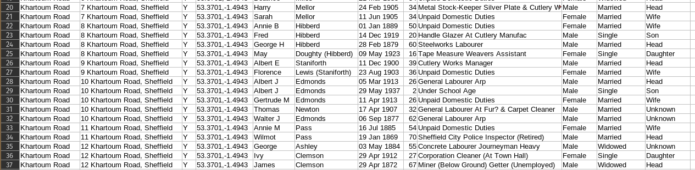

# Census data

Exporting census data for households from a few streets from the 1939 Register.

For a while in April 2025, <https://www.findmypast.co.uk/search-address/> was free to use for anyone.



## Get Data

See [search.sh](./search.sh) and [single.sh](./single.sh) (requires token via Cookie).

```bash
# run search, get search area ID for search.sh, then
./search.sh > search_wadbrough.json
cat search_wadbrough.json | jq -r '.data.street.records | .[] | .fields | .[] | select(.fieldName=="BaseUppId") | .value' > search_wadbrough_ids.txt
# get Cookie for access and put into single.sh, then
while read id; do
  file=$(echo "${id}" | sed 's+/+-+g')
  [[ -f "wadbrough/${file}.json" ]] && echo "file already exists! skipping..." && continue
  echo "fetching ${id} for file ${file}.json…"
  ./single.sh "${id}" > "wadbrough/${file}.json"
  sleep 1
done < search_wadbrough_ids.txt
# repeat the above for other streets
```

## Parse data

```bash
# see a rough idea of data for a particular file
$ ./extract.sh thompson/TNA-R39-3506-3506D-008-21.json
{
  …
  "County": "Yorkshire (West Riding)",
  "LatLon": "53.3705,-1.4951",
  "Address": "8 Thompson Road, Sheffield",
  …
}
{
  "BirthDate": "03 Jul 1887",
  "FirstName": "Frank",
  "Gender": "Male",
  "Id": "TNA/R39/3506/3506D/008/21",
  "LastName": "Morton",
  "MaritalStatus": "Married",
  "OccupationText": "Caretaker At Colliery Engineering Office",
  "Relationship": "Head",
  "Schedule": "78",
  "ScheduleSubNumber": "1",
  "ApproxAge": "52"
}
…
```

```bash
# make a CSV out of all data files
./make_csv.sh > all.csv
```
